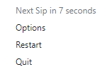
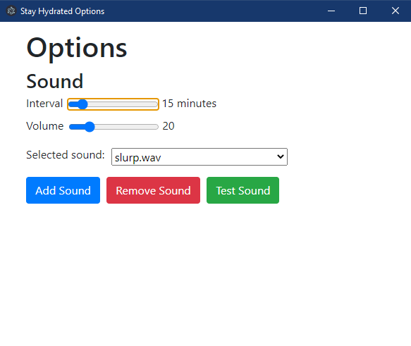

## About The Project
_Stay Hydrated_ is a desktop app that reminds you to drink water via a customizable sound cue.

### Built With
- [TypeScript](typescript-url)
- [Electron](electron-url)

## Getting Started

### Installation
The latest official installer for Windows can be found at [Github Releases](github-releases-url) page.

## Default behaviour
App starts minimized to tray on user system login.
A sound cue plays every 15 minutes by default.
Users can add custom sounds to the available sounds pool.

#### Tray Menu

#### Options Window

## Sound credits
- `slurp` by [fille1000](slurp-url), available under the [Sampling Plus 1.0](creative-commons-licence-url)

## License
Distributed under the MIT License. See [LICENSE](licence-url) for more information.

<!-- VARIABLES -->
[slurp-url]: https://soundbible.com/1527-Slurp.html
[licence-url]: https://github.com/kbohdanowicz/Stay-Hydrated/blob/main/LICENSE
[typescript-url]: https://www.typescriptlang.org/
[electron-url]: https://www.electronjs.org/
[github-releases-url]: https://github.com/kbohdanowicz/Stay-Hydrated/releases
[creative-commons-licence-url]: https://creativecommons.org/licenses/sampling+/1.0/
